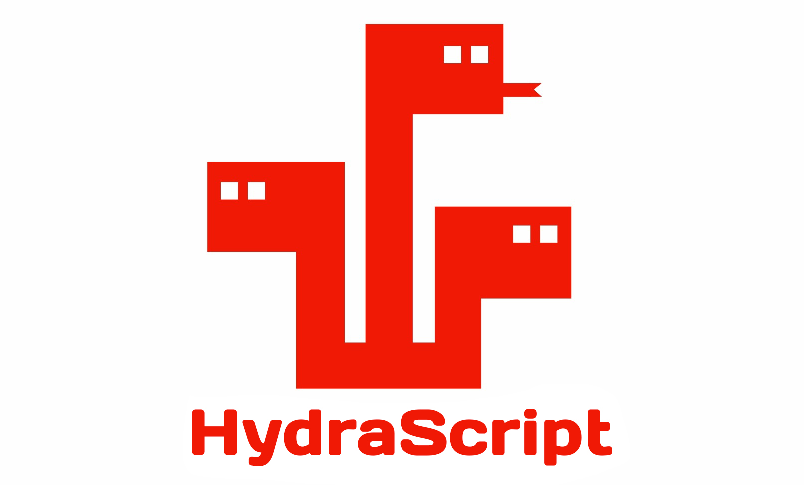

# HydraScript



## Installation

Interpreter executable is built during release for 3 following platforms:
- Windows (x64)
- MacOS (arm64 Apple Silicon)
- Linux (x64)

Download hydrascript executable on the corresponding release page.

[The latest relase is available here.](https://github.com/Stepami/hydrascript/releases/latest)

Alternatively you can consume HydraScript as dotnet tool:
```
dotnet tool update --global hydrascript
```

## Project History

It started as a bachelor thesis "Extended JavaScript Subset". Now it's named "HydraScript", because as I fix one bug another occurs.

I took [ECMA-262 standard](https://www.ecma-international.org/publications-and-standards/standards/ecma-262/) as a basis and made:
- [Lexical structure](src/Domain/HydraScript.Domain.Constants/TokenTypes.cs)
- [Grammar](src/Domain/HydraScript.Domain.FrontEnd/Parser/grammar.txt)

[Working samples can be found here.](tests/HydraScript.IntegrationTests/Samples) I use them for integration tests.

## Project Goals
1. Partially implement JavaScript with objects and strong static structural typing, getting rid of such things as: `constructor`, `class`, `interface`
2. Publicly reverse engineer modern static analysis (type inference, forward refs, compile-time detection of the runtime errors, etc.)
3. Simplifying compilers construction domain with HydraScript source code
4. Gather clear and concise standard problem solutions and algorithm implementations (Lexer, Parser, CFG, SSA, DCE, etc.)

## Language docs

### Comments

All comments are single-line:
```
// double slash comment
# shebang comment
```

### Typing
The HydraScript has strong static structural typing.

There are 5 primitive types:
1. number
2. boolean
3. string
4. null
5. void

The other types can be grouped as such:
- NullableType (type that allows ```null```)
- ObjectType (the type of object, obviously, and also is NullableType)
- ArrayType (the type of array)

**The types have the following default values:**

| Type         | Value |
|--------------|-------|
| number       | 0     |
| boolean      | false |
| string       | ""    |
| NullableType | null  |
| ArrayType    | []    |

**You can also create your own type alias as in C++ or TypeScript:**
```
type int = number
type maybeInt = int?
type ints = int[]
type point = {
    x: int;
    y: int;
}
type composite = {
    p: point;
    arr: ints;
}
```

#### Strings

Strings support following operations:
- index access, returns `string`:
```
let str = "str"
>>> str[1] // t
```
- length getter:
```
let str = "str"
>>> ~str // 3
```

### Variables

For declaring mutable variables use `let`:
```
let i = 1 // HydraScript infers type from expression
let j: number // Here it writes to j the default value
let k: number = 1 // Fully explicit declaration
```
For declaring readonly variables use `const`:
```
const flag = true
```

To work with Environment Variables place `$` before identifier:
```
$MY_ENV_VAR = "my_env_var_value"
const flagValue = $FLAG_VALUE
```

### Input and Output

The HydraScript is able to print any values in console and read strings from it:
```
# output
>>> [1, 2, 3]
>>> { x: true; }
>>> "Hello, world!"

// input
let name: string
<<< name
```

### Objects

Object literal declaration is similar to JSON:
```
let v2d = {
    x: 3;
    y: 4;
}
```

You can clone objects using `with` expressions like in C#:
```
let v = {
    x: 2;
    y: 1;
}

let vToX = v with { y: 0; }
```

### Arrays

HydraScript arrays are basically lists. Legacy naming, unfortunately.

Array literal declaration is similar to JSON:
```
let array = [1, 2, 3]
```

You have special operators to work with arrays:
```
let size = ~array // length
array::1 // remove at index
array = array ++ [5, 7] // concatenation
```

### Operators

| Operator         | Binary or Unary | Operand Types              | Result Type      |
|------------------|-----------------|----------------------------|------------------|
| +                | binary          | both number or both string | number or string |
| *, -, /, %       | binary          | number                     | number           |
| &#124;&#124;, && | binary          | boolean                    | boolean          |
| !=, ==           | binary          | same on both sides         | boolean          |
| <=, >=, >, <     | binary          | number                     | boolean          |
| !                | unary           | boolean                    | boolean          |
| -                | unary           | number                     | number           |
| ++               | binary          | []                         | []               |
| ::               | binary          | [] and number              | void             |
| ~                | unary           | [] or string               | number           |

### Conditionals

The language supports classic `if-else`:
```
if (1 == 1) {
    // ...
} else if (2 == 2) {
    // ...
}
else {
    // ...
}
// basically C-like syntax and semantic
// test expression must have boolean type
```

There is also ternary operator:
```
let x = 1 > 0 ? 0 <= 1 ? 1 : 0 : -2 < 0 ? -1 : 0
```

### Loops

Now it has only `while`:
```
while (cond) {
    // ...
    continue
    // ...
    break
}
```

### Functions

Functions are similar to TypeScript:
```
// declaration
function add(a: number, b: number): number {
    return a + b
}

// call
let c = add(1, 2)
```

The return type can be specified explicitly or inferred:
```
// this is also valid
function add(a: number, b: number) {
    return a + b
}
let c = add(1, 2) // c is number
```

### Methods

A function can be method if it's bound to an object using the "Golang-like approach":
```
# The binding is done with object type alias

// step 1. Declare type alias
type Point2 = {
    x: number;
    y: number;
}

// step 2. Declare variable of type defined earlier
// It's obligatory to explicitly define type after colon to make it work
let v2d: Point2 = {
    x: 3;
    y: 4;
}

// step 3. While declaring function place first the paremeter with aliased object type
// it's basically explicit "this"
function lengthSquared(obj: Point2) {
    let x = obj.x
    let y = obj.y
    return x * x + y * y
}

// step 4. make a call
let s = v2d.lengthSquared()
```

### Overloads and default parameters

Both, methods and functions, do support overloading and default parameters:
```
function func(x = 0){
    >>> x
}

function func(x:number, y:number) {
    return x + y
}

func()
func(1)
func(func(2, 3))
```

### Access operators

Access means being able to get element of an array or property of an object:
```
// objects
let x = v2d.x

// arrays
let l = array[2]
```

### Type casting

HydraScript supports explicit casting through `as` keyword:
```
let s = v2d as string
let one = "1" as number
let falseValue = 0 as boolean

let nullableNumber = null as number?
```

One can cast using following rules:
- `any` -> `string`
- `string` -> `number`
- `string` -> `boolean`
- `boolean` -> `number`
- `number` -> `boolean`
- `type?` -> `type`
- `type` -> `type?`
- `null` -> `type?`

## Requirements

Before **2.3.0** version executable launch needed [.NET Runtime installed.](https://dotnet.microsoft.com/ru-ru/download/dotnet)

There is match table of hydrascript and dotnet:

| hydrascript                                                       | dotnet |
|-------------------------------------------------------------------|--------|
| <ul><li>1.0.0</li><li>1.0.2</li></ul>                             | .NET 5 |
| <ul><li>1.1.2</li><li>1.1.3</li><li>1.1.4</li><li>1.1.5</li></ul> | .NET 6 |
| <ul><li>1.2.5</li><li>1.2.6</li><ul>                              | .NET 7 |
| 2.0.0                                                             | .NET 8 |
| <ul><li>2.1.0</li><li>2.1.1</li><li>2.2.0</li></ul>               | .NET 9 |

If you use dotnet tool then requirements is specified on NuGet page.

## Build from source
Install **latest** .NET SDK. The project uses **SLNX** as solution format.

Do this inside `HydraScript` root after cloning repository:
```dotnet publish ./src/HydraScript/HydraScript.csproj -r <RUNTIME_IDENTIFIER> -o <OUTPUT_DIRECTORY>```

[Runtime identifier list can be found here](https://docs.microsoft.com/en-us/dotnet/core/rid-catalog#windows-rids)

## How to run

Default:
```
HydraScript file.js
```

Dumping debug info as files (tokens, ast, ir code):
```
HydraScript file.js --dump
```

## Sources:

1. "Compilers Construction" and "Optimized Code Generation" courses of [@bmstu-iu9](https://www.github.com/bmstu-iu9)
2. [ECMA-262](https://www.ecma-international.org/publications-and-standards/standards/ecma-262/)
3. [DragonBook](https://suif.stanford.edu/dragonbook/)
4. [Stanford CS143 Lectures](https://web.stanford.edu/class/archive/cs/cs143/cs143.1128/)
5. [Simple Virtual Machine](https://github.com/parrt/simple-virtual-machine)
6. Ахо А., Ульман Дж. Теория синтаксического анализа, перевода и компиляции
7. Свердлов С.З. Языки программирования и методы трансляции
