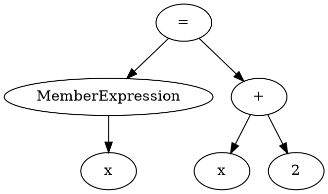

# Interpreter dumps

Use `--dump` to save the intermediate representations of a script while running it. This helps distinguish tokenization, parsing, and instruction-generation problems. Dumping is not a dry run: the script still executes and can perform its usual input/output.

## Generate the files

Save this as `sample.js`:

```text
let x = 1
x += 2
>>> x
```

Run it with:

```shell
hydrascript sample.js --dump
```

The script prints `3`. The option also accepts `-d` and `/d`.

| File | Contents | Written when |
| --- | --- | --- |
| `sample.tokens` | Plain-text lexer token stream | Tokenization finishes successfully |
| `sample.dot` | Abstract syntax tree (AST) in Graphviz DOT format | Parsing finishes, before static analysis |
| `sample.tac` | Plain-text three-address-code (TAC) instruction listing | Static analysis and code generation finish, just before VM execution |

Files are written beside the source script, not necessarily in the terminal's working directory. For example, `hydrascript scripts/sample.js --dump` writes `scripts/sample.tokens`, `scripts/sample.dot`, and `scripts/sample.tac`. The source directory must be writable.

## `.tokens`: what the lexer recognized

Each token includes its kind, source span, and source spelling. Line and column numbers start at 1; the end coordinate is exclusive. For the example's second line:

```text
Ident (2, 1)-(2, 2): x
Assign (2, 3)-(2, 5): +=
IntegerLiteral (2, 6)-(2, 7): 2
```

Here, `+=` is one assignment token, not separate `+` and `=` tokens. Comments and whitespace are omitted; the stream ends with `EOP` (end of program). Use this file to check token boundaries, operator recognition, and source coordinates.

## `.dot`: how the parser grouped the syntax

DOT is a graph-description language, not an image format. The dump begins with `digraph ast`; nodes have syntax labels, and arrows connect parents to children. It represents the parsed tree before type checking, not a control-flow graph.

The parser already expands `x += 2` into `x = x + 2`. This excerpt shows that subtree, with node IDs shortened and unrelated nodes omitted:



With [Graphviz](https://graphviz.org/doc/info/command.html) installed and its `dot` command on your path, render the full dump as SVG:

```shell
dot -Tsvg sample.dot -o sample.svg
```

Open `sample.svg` in a browser or image viewer. Graphviz is only needed for rendering; the interpreter creates the DOT file without it. Generated node IDs can change between runs, so compare tree structure and labels rather than IDs.

## `.tac`: what the VM will execute

TAC means three-address code: complex expressions are lowered into simple operations, alongside instructions for control flow, calls, and input/output. This is HydraScript's VM instruction listing, not native assembly or .NET IL.

For the sample, the listing looks like this, with the generated temporary name shortened to `_t1`:

```text
x = 1
x = x + 2
_t1 = x as String
Output _t1
End
```

The output path converts the value to a string before printing it. Larger programs also contain temporaries, labels, jumps, and function calls. Temporary names can vary between runs.

The listing is written before execution: it does not contain the resulting value of every variable, visited branches, or an execution trace. Having a `.tac` file does not prove the program ran successfully.

## Failed runs and existing files

Each stage overwrites its own dump when reached. A lexer error prevents a fresh token dump; a parser error can leave only a fresh `.tokens` file; a static-analysis error can leave fresh `.tokens` and `.dot` files but no fresh `.tac`. Runtime errors can occur after all three have been written.

Old dumps from earlier runs are not automatically removed. Check timestamps or remove the old generated files before retrying, so a stale file is not mistaken for output from a failed run. Dumps can contain source literals and other sensitive script content; review them before sharing or committing.

See the [architecture guide](../.agents/architecture.md) for the pipeline and [dumping adapters](../src/Infrastructure/HydraScript.Infrastructure/Dumping) for the implementation.